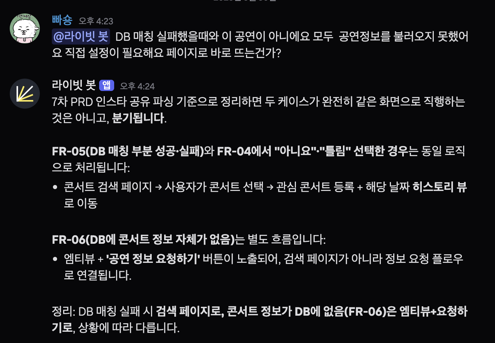
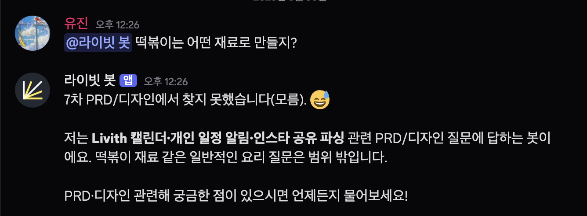
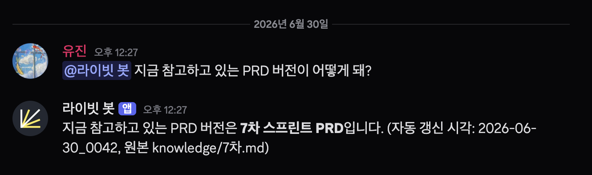

## 라이빗 PRD·디자인 Q&A Bot

Notion PRD와 Figma 디자인을 근거로 팀의 질문에 답하는 Discord 봇입니다.
런타임은 [Hermes Agent](https://github.com/NousResearch), 빌더는 Claude Code + [oh-my-claudecode](https://github.com/Yeachan-Heo/oh-my-claudecode)(OMC)입니다.
PRD와 와이어프레임을 기반으로 할루시네이션 없이 정확한 정보에 근거해 답변하도록 설계했습니다.

```
Discord 멘션 → Hermes (qa-bot 프로파일)
                ├─ PRD 지식 : SOUL 스냅샷 (시스템 프롬프트 · 결정적)
                └─ 디자인    : Figma MCP (실시간 조회)
             → 출처(FR 번호 / 프레임) 달린 답변
```

### 실행 예시

| 근거 있는 답변 | 환각 방지 | 스냅샷 버전 인식 |
|:---:|:---:|:---:|
|  |  |  |
| PRD 질문에 **FR 출처**로 답합니다 | 스코프 밖이면 지어내지 않고 **"모른다"** | 현재 PRD 버전·**갱신 시각**을 압니다 |

### 막연한 한 줄을 deep-interview로 80% 기준까지 구체화

시작은 "PRD QA 봇을 만들자"는 막연한 한 줄이었습니다. 빌더 쪽에 OMC를 얹고, 그 `deep-interview` 스킬(소크라테스식 질문 + 모호도 수치화)로 범위를 깎았습니다.

모호도 100%에서 시작해, 매 라운드 **가장 약한 지점 하나만** 찔러 질문하며 18.5%(임계 20%)까지 떨어뜨렸습니다. 그 과정에서 호스팅을 클라우드 대신 **Mac 로컬 상시 구동**으로 정하고, "성공"을 **20문항 중 16개(80%) 출처 있는 정답**이라는 측정 가능한 기준으로 못 박았습니다. 이 80% 기준이 이후 모든 평가의 잣대가 됐습니다. (결과 스펙은 `.omc/specs/`에 남겼고, 비공개입니다.)

### 플랜에 막힌 DB를 통합 토큰으로 해결

요구사항(FR)은 Notion 페이지 본문이 아니라 **데이터베이스** 안에 있었습니다. 그런데 처음 쓴 호스티드 Notion MCP(OAuth)는 페이지는 읽어도 DB 쿼리(`query_data_sources`)가 **Notion Business 플랜 이상을 요구**해 막혔습니다. 봇은 DB 이름만 보고 정작 행(요구사항)은 못 읽어, 정책·캘린더 질문에 답이 통째로 비었습니다.

해결은 커넥터 교체였습니다. 통합 토큰 방식 MCP(`@notionhq/notion-mcp-server`)로 갈아탔습니다. 클래식 Notion API의 `databases.query`는 **플랜과 무관하게** 동작합니다 — 통합에 PRD 페이지·DB를 공유하기만 하면 됩니다. 내부 통합을 만들고 공유한 뒤 `notion-api`로 붙이니, 막혀 있던 FR 19개가 한 번에 전부 읽혔습니다.

### 무너지는 실시간 검색을 스냅샷으로 결정화

DB를 뚫고 나니, 이번엔 실시간 조회 자체가 불안정했습니다. 두 군데서 비결정적이었습니다.

- 통합 토큰 MCP는 DB를 읽지만 **연속 호출 시 404·레이트리밋으로 무너졌습니다**.
- Hermes 스킬은 progressive-disclosure라 **본문 로드가 들쭉날쭉했습니다**.

스프린트 PRD는 작습니다. 그래서 전체를 한 번 추출해 스냅샷으로 고정하고, Hermes의 **항상 로드되는 시스템 프롬프트(`SOUL.md`)** 에 박았습니다. 런타임 검색이 0이 되니 답이 결정적으로 변했습니다.

```
실시간 MCP (호스티드)      75~85%   경계선
실시간 MCP (통합토큰·부하) ~30%     404 붕괴
스냅샷 in 시스템 프롬프트   92%      결정적
```

### 스냅샷이 안 되는 Figma는 실시간 조회로 분리

PRD 텍스트는 작고 정적이라 스냅샷이 맞습니다. Figma 파일은 6~23MB라 시스템 프롬프트에 못 넣습니다. 그래서 **디자인 질문만 `get_figma_data`로 실시간 조회합니다**. 같은 "지식"이라도 크기와 변동성이 저장 방식을 가릅니다.

### 프롬프트로 안 되는 그라운딩을 툴 제한으로 강제

"컨텍스트 안에서만 답하라"는 프롬프트만으로는 그라운딩이 깨집니다. `file`·`terminal`·`web` 툴이 켜져 있으면 에이전트가 로컬 파일시스템·다른 레포를 뒤져 엉뚱하게 답합니다. 봇은 **이 툴들을 비활성한 채** 실행해, 물리적으로 PRD·디자인만 보게 만듭니다.

### 환각 대신 '모른다'와 출처 표기

봇은 평가하지 않습니다. 검색해서 사실대로 답하고, 근거가 없으면 지어내는 대신 **"PRD에서 찾지 못했습니다"** 라고 합니다. 평가셋에는 스코프 밖 질문을 섞어, 환각(없는 사실의 단정)을 오답으로 잡습니다.

### 낡는 스냅샷을 검증 후 매일 갱신

PRD가 바뀌면 스냅샷이 낡습니다. `hermes cron`이 매일 PRD를 재추출하되, **검증을 통과해야만** SOUL을 갱신합니다. 추출이 실패(404 등)하면 기존 스냅샷을 그대로 보존합니다.

### 구성

#### 런타임

| 요소 | 한 줄 | 맥락 |
|------|------|------|
| `qa-bot` 프로파일 | 봇 전용 Hermes 프로파일 (SOUL·툴·MCP 격리) | 전역 hermes 오염 없음 |
| SOUL 스냅샷 | 시스템 프롬프트에 PRD 지식 내장 | 런타임 검색 0, 결정적 |
| Figma MCP | 디자인 질문 시 실시간 조회 | 대용량이라 스냅샷 불가 |
| Discord 게이트웨이 | 멘션→응답, `launchd` 상시 구동 | allowlist로 사용자 제한 |

#### 지식 · 수집

| 요소 | 한 줄 | 맥락 |
|------|------|------|
| `knowledge/<스프린트>.md` | PRD+FR 스냅샷 원본 (비공개) | 버전관리·동기화 기준 |
| `notion-api` MCP | 통합 토큰 기반 DB 쿼리 | 호스티드 MCP의 플랜 한계 우회 |

#### 자동화 · 검증

| 요소 | 한 줄 | 맥락 |
|------|------|------|
| `update_snapshot.sh` + cron | 매일 재추출→검증→SOUL 동기화 | 검증 실패 시 기존 보존 |
| `eval/questions.md` | 정답률 평가셋 (목표 80%) | 스냅샷 구성 92% 달성 |

### 셋업

```
1. Hermes 설치 + 모델 연결        (hermes setup)
2. Notion·Figma MCP 연결          (DB 쿼리는 통합토큰 방식 @notionhq/notion-mcp-server)
3. PRD+FR 추출 → 프로파일 SOUL에 스냅샷 내장
4. 답변 그라운딩은 툴셋 제한으로 강제 (file/terminal/web 비활성)
5. 평가셋으로 정답률 측정          (목표 80%)
6. hermes gateway install         (Discord 연결 + launchd 상시 구동)
7. hermes cron으로 일일 스냅샷 갱신 자동화
```

봇의 런타임 산출물(SOUL 스냅샷·스킬·cron)은 이 레포가 아니라 `~/.hermes/`에 있습니다.

### 문서

| 파일 | 내용 |
|------|------|
| `CLAUDE.md` | 빌더(Claude Code)용 아키텍처·작업 가이드, 실측 로그 |
| `SECURITY.md` | 시크릿·토큰 취급 정책 (에이전트 포함) |
| `knowledge/README.md` | PRD 스냅샷 디렉터리 설명 (데이터는 비공개) |
| `eval/README.md` | 평가셋 방법론 (문항은 비공개) |
